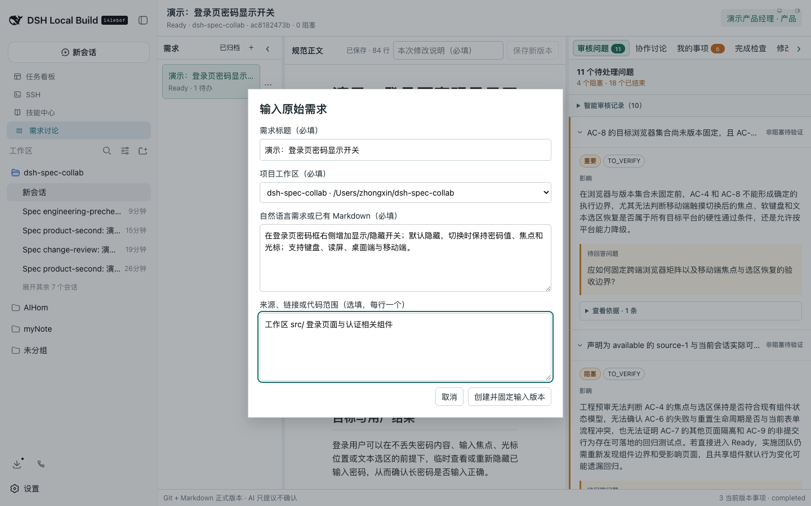
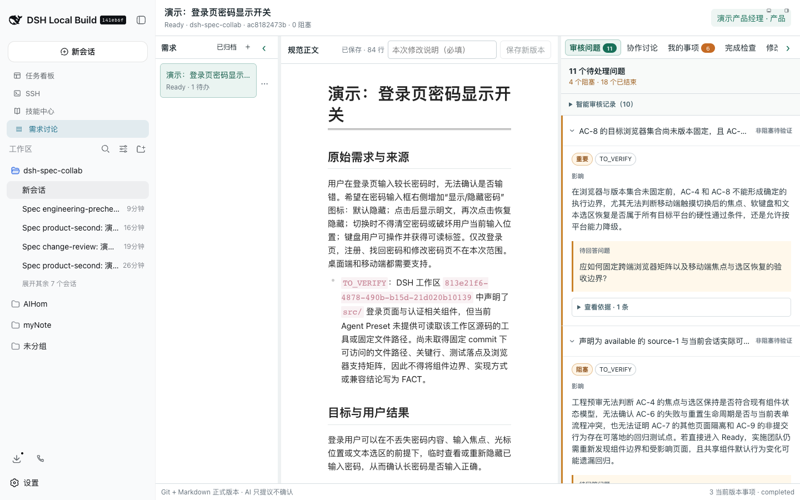
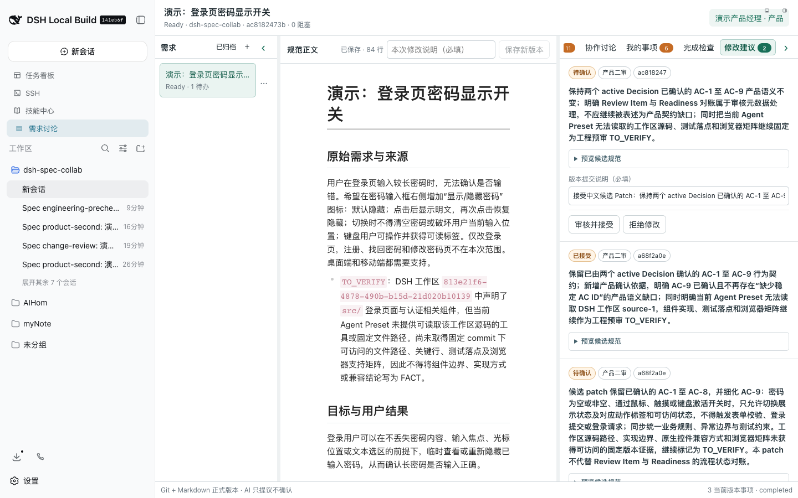
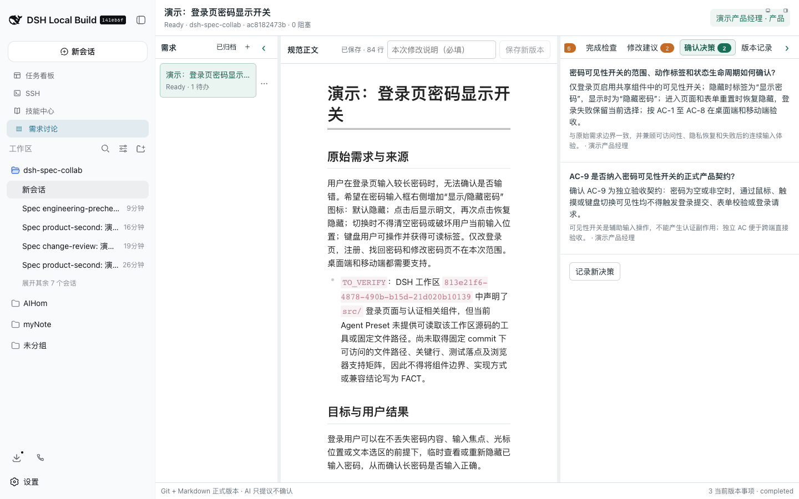
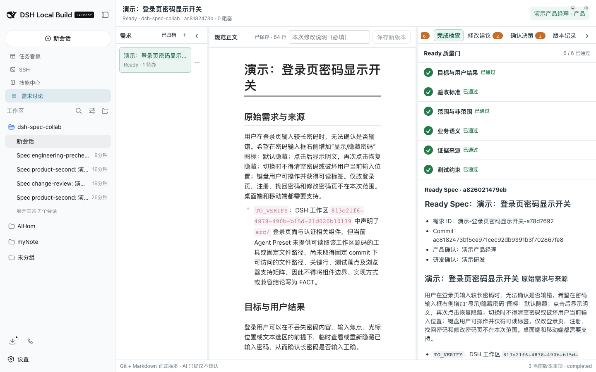

# 完整使用演示：从原始需求到 Ready Spec

本演示使用需求“登录页密码显示开关”走完产品初审、产品复审、候选 Patch、人工决策、产品确认、研发预审、研发确认和 Ready 质量门。演示中的所有 AI 操作都绑定到所选 DSH 工作区，人工确认绑定到精确 Git commit。

[观看完整流程录屏（MP4）](assets/spec-collab-walkthrough.mp4)

## 演示需求

> 用户在登录页输入较长密码时，无法确认是否输错。希望在密码输入框右侧增加“显示/隐藏密码”图标：默认隐藏；点击后显示明文，再次点击恢复隐藏；切换时不得清空密码或让输入框失去焦点；键盘用户可操作并获得可读标签。仅改登录页，注册、找回密码和修改密码页不在本次范围。桌面端和移动端都需要支持。

## 1. 新建需求并选择工作区

点击需求栏右上角的 `+`，填写需求标题、原始需求和来源。项目工作区是必填项；插件不会允许需求进入“未分组”工作区，因为后续 AI 初审、复审和评论分析都需要从这里继承项目的 Skill、MCP、本地参考文档及 Agent Preset。

创建后，原始输入会立即固定为第一个 Git commit。需求一旦绑定工作区便不能中途切换，避免同一份 Spec 的审核上下文发生漂移。

## 2. 运行智能初审并逐项回复

点击“智能初审”。AI 会按目标、范围、业务语义、验收标准、风险、当前实现、历史冲突和证据等维度生成结构化 Review Item。每条结论都会标注 `FACT`、`INFERENCE`、`ASSUMPTION` 或 `TO_VERIFY`。

处理审核项时遵循以下规则：

- 有业务结论时选择推荐方案或自行输入，并说明取舍。
- 有固定版本证据时补充来源、版本和证据说明。
- 当前无法核验源码、历史或浏览器矩阵时选择 `TO_VERIFY`，不要把推测写成 `FACT`。
- `接受 AI 建议` 用于无需修改正文即可确认的结论；`修改后接受` 表示仍需等待候选 Patch。

## 3. 智能复审并接受候选 Patch

产品回复完成后运行“智能复审”。AI 会检查回复是否真正覆盖原问题，并生成基于精确 `baseCommit` 的候选 Patch。打开“修改建议”，预览完整候选规范，确认变更范围和 AC 后由人工点击接受。

AI 只能提议 Patch，不能直接写 Git。人工接受后插件创建新 commit，并自动触发 change review；基于旧 commit 的候选 Patch 会失效。

## 4. 记录 Decision 并确认产品版本

对状态生命周期、范围边界或新增 AC 等关键选择，在“确认决策”中记录 Decision。Decision 与普通评论分离，包含结论、理由、确认人及受影响章节或 AC。

产品二审无当前版本阻塞项后进入“产品确认”，由产品确认当前 commit。任何后续正文修改都会使受影响的确认失效，必须重新确认。

## 5. 研发预审、双角色确认和 Ready

进入“产研共审”后运行“研发智能预审”。工程侧重点核验当前实现、共享组件影响、测试落点、浏览器矩阵及历史约束。演示工作区没有目标业务仓库源码，因此相关项被明确保留为非阻塞 `TO_VERIFY`，而不是虚构实现证据。

研发确认与产品确认必须绑定同一个当前 commit。随后点击“生成就绪规范”，只有以下六项全部通过才能生成 Ready Spec：

- 目标与用户结果
- 验收标准
- 范围与非范围
- 业务语义
- 证据来源
- 测试约束

本次演示最终生成的 Ready Spec 绑定 commit `ac8182473bf5ce971cec92db9391b3f702867fe8`，产品和研发均确认该版本。历史 Review Item 保留在审核记录中用于审计，但不会继续阻塞新 commit；当前未核验的实现和兼容性问题则进入 Ready Spec 的“非阻塞 Open Questions”。

## 正确使用要点

1. 新建需求时选择真实项目工作区，先配置好该工作区需要的 Skill、MCP 和参考文档路径。
2. 把 AI 当作审核者和提议者，不让 AI 代替产品或研发确认。
3. 每个事实都提供可访问、版本固定的证据；缺证据时使用 `TO_VERIFY`。
4. 接受 Patch 前检查 `baseCommit`、受影响章节和 AC；正文变化后重新完成必要审核与确认。
5. 产品和研发必须确认同一个当前 commit，六项质量门通过后再生成 Ready Spec。
